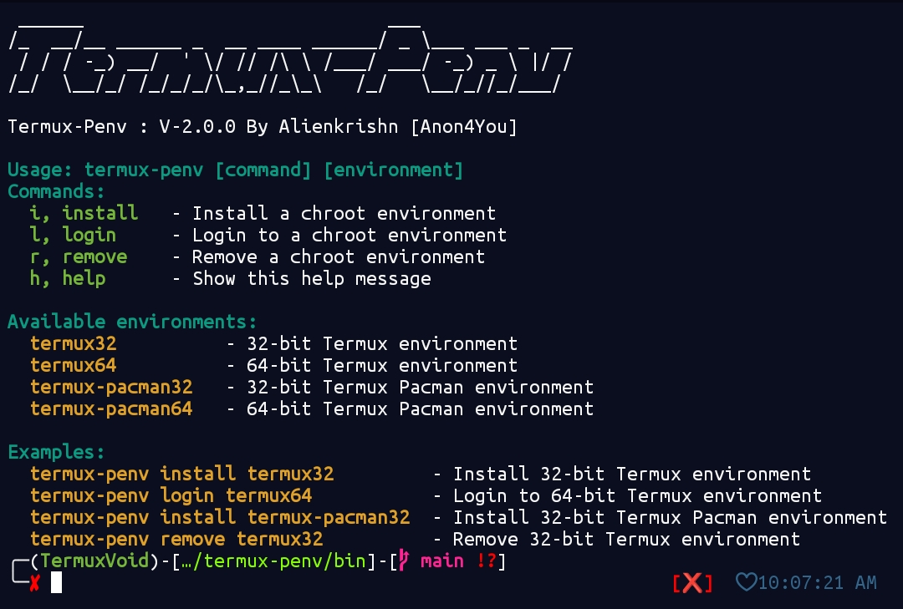

# Termux Penv v2.0.0 - Chroot Environment Manager 🛠️

**Termux Penv** is a sleek shell script for managing 32-bit and 64-bit chroot environments in Termux. Perfect for cross-compilation and testing apps across architectures, it now supports Pacman-based environments for Arch Linux-style package management. 🚀

---

## Features 🌟

- **Multi-Architecture**: Run 32-bit (`termux32`, `termux-pacman32`) and 64-bit (`termux64`, `termux-pacman64`) environments side-by-side. 🖥️
- **Cross-Compilation**: Build apps for various CPU architectures. 🔧
- **Isolated Testing**: Test apps in clean environments for ARMv7, i686, aarch64, or x86_64. 🧪
- **Pacman Support**: Use `termux-pacman32` and `termux-pacman64` for Arch-style package management. 📦
- **Simple Commands**: Install, login, and remove environments with ease. 📜

  
*Screenshot: Termux Penv Script*

---

## Installation 📥

### Option 1: Quick Install (Recommended)
```bash
curl -sL https://github.com/Anon4You/termux-penv/raw/main/install.sh | bash
```

Installs `termux-penv` to `$PREFIX/bin` and scripts to `$PREFIX/share/termux-penv`.

### Option 2: Termux Void Repository
Add the [Termux Void Repository](https://github.com/termuxvoid), then:
```bash
apt install termux-penv -y
```

---

## Usage 🚀

### Syntax
```bash
termux-penv [command] [environment]
```

### Commands
- `install` (`i`): Set up a chroot environment. 🏗️
- `login` (`l`): Access a chroot environment. 🔑
- `remove` (`r`): Delete a chroot environment. 🗑️
- `_.

### Environments
- `termux32`: 32-bit environment (ARMv7, i686). 🖥️
- `termux64`: 64-bit environment (aarch64, x86_64). 💻
- `termux-pacman32`: 32-bit Pacman-based environment. 📦
- `termux-pacman64`: 64-bit Pacman-based environment. 📦

---

## Examples 🎯

### 1. Install Environments
```bash
termux-penv install termux64
termux-penv install termux32
termux-penv install termux-pacman64
termux-penv install termux-pacman32
```

### 2. Cross-Compile (64-bit to 32-bit)
```bash
termux-penv login termux64
apt install clang gcc make binutils
CC="clang -target armv7a-linux-androideabi" ./configure --host=arm-linux-androideabi
make
```

### 3. Test Application
```bash
termux-penv login termux32
./your-compiled-32bit-binary
```
Or in a Pacman environment:
```bash
termux-penv login termux-pacman32
./your-compiled-32bit-binary
```

---

## Script Locations 📂

Scripts are stored in `$PREFIX/share/termux-penv`:
- **Install**: `termux32.sh`, `termux64.sh`, `termux-pacman32.sh`, `termux-pacman64.sh`
- **Login**: `termux32login.sh`, `termux64login.sh`, `termux-pacman32login.sh`, `termux-pacman64login.sh`
- **Remove**: `termux32remove.sh`, `termux64remove.sh`, `termux-pacman32remove.sh`, `termux-pacman64remove.sh`

---

## Use Cases 🎮

- Cross-compile games, libraries, or system tools. ⚙️
- Test apps across architectures. 🧪
- Develop with Pacman-based package management. 📦
- Learn CPU architectures or analyze malware. 🔍

---

## Contributing 🤝

1. Fork the repository. 🍴
2. Create a branch: `git checkout -b feature/new-feature`
3. Commit changes: `git commit -m "Add new feature"`
4. Push: `git push origin feature/new-feature`
5. Submit a pull request. 🚀

Report bugs or suggest features via GitHub Issues.

---

## License 📜

BSD-3-Clause License. See [LICENSE](LICENSE) for details.

---

## Acknowledgments 🙏

- **Termux Team**: For the awesome Termux platform. 🐧
- **Termux-Pacman Team**: For enabling Pacman-based environments. 📦
- **Open Source Community**: For shared tools and knowledge. 🌍

---

## Support 💖

Star the project on GitHub if it boosts your workflow! 🌟

---

**Version 2.0.0** - Now with `termux-pacman32` and `termux-pacman64` for flexible development! 🎉

